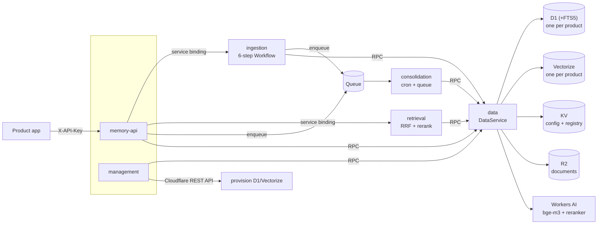

# Deep Recall

[](./LICENSE)

**Cross-product agentic memory, built entirely on Cloudflare.** Deep Recall gives AI products long-term memory: send it conversations or documents, and it extracts structured memories (facts, episodes, foresight, profiles), reconciles them against what it already knows (supersede, merge, or skip — no duplicates), and serves them back through hybrid retrieval on every agent turn. No external databases, no Kubernetes, no multi-vendor infrastructure — six Workers, D1, Vectorize, KV, R2, Queues, and Workflows.

## Why Deep Recall

- **Extract → Reconcile → Persist.** A durable 6-step Workflow pipeline turns raw content into typed MemCells, runs them through a deterministic policy engine (PII rules, confidence thresholds, rate limits, auto-expiry) — governance in code, not prompts — then LLM-reconciles each candidate against existing memories before anything is written.
- **Hybrid retrieval that earns its ranking.** D1 FTS5 (BM25) and Vectorize (cosine) fan out in parallel, merge via Reciprocal Rank Fusion, and a cross-encoder reranker orders the fused pool. The query hot path is LLM-free; the optional `/v1/answer` endpoint adds a single LLM call for citation-backed answers.
- **Multi-tenant by construction.** Every product gets its own D1 database and Vectorize index — a router resolves the API key to the right bindings, so tenant isolation is structural, not a `WHERE` clause. Inside a product, memories scope to `(user_id?, agent_id?, session_id?)`, including agent-only shared knowledge.
- **Accountable memory.** Append-only audit log for every mutation, full provenance on every record, user-facing correction (pin/suppress/update) and cascading purge flows (D1 + Vectorize + R2).

## Benchmark: LoCoMo

**72.8% LLM-judge accuracy (categories 1–4) · 49.8% official all-5 token-F1** — all 10 conversations, 1,986 questions, answered by the shipped pipeline (`/v1/answer`, `claude-sonnet-5`). For reference, the LoCoMo paper's best RAG setup scores ≈ 43 token-F1 and gpt-4-turbo with full long-context scores 51.6. Methodology, guardrails, per-category tables, and dev/held-out splits: [benchmarks/](./benchmarks/README.md) and [results](./benchmarks/locomo/results/RESULTS.md); to reproduce, see [docs/BENCHMARKING.md](./docs/BENCHMARKING.md).

## Architecture



Only `memory-api` and `management` accept HTTP. The data worker is the sole owner of storage bindings — everything else reaches storage through its RPC interface, which is what keeps the data layer portable (the documented escape hatch is swapping D1 for Postgres without touching the pipeline). Full design rationale: [docs/ARCHITECTURE.md](./docs/ARCHITECTURE.md).

## Quickstart

```bash
pnpm install
npx turbo build typecheck lint test   # everything runs locally, no Cloudflare account needed
```

To deploy the six workers, create the Cloudflare resources, and seed configuration, follow [docs/DEPLOYMENT.md](./docs/DEPLOYMENT.md) — it covers resource creation, the required Vectorize metadata indexes, the per-worker secrets matrix, KV seeding, migrations, deploy order, and local development.

## Where to go next

| You are…                               | Start with                                                                                |
| -------------------------------------- | ----------------------------------------------------------------------------------------- |
| Integrating an app with the API        | [docs/API_GUIDE.md](./docs/API_GUIDE.md) · [Postman collection](./postman/)               |
| Operating a deployment                 | [docs/DEPLOYMENT.md](./docs/DEPLOYMENT.md) · [docs/ADMIN_GUIDE.md](./docs/ADMIN_GUIDE.md) |
| Onboarding another product (tenant)    | [docs/ONBOARDING.md](./docs/ONBOARDING.md)                                                |
| Understanding the design               | [docs/ARCHITECTURE.md](./docs/ARCHITECTURE.md)                                            |
| Reproducing or extending the benchmark | [docs/BENCHMARKING.md](./docs/BENCHMARKING.md) · [benchmarks/](./benchmarks/README.md)    |
| Contributing                           | [CONTRIBUTING.md](./CONTRIBUTING.md)                                                      |

## Repository layout

**Workers** (deploy units — order matters, see DEPLOYMENT.md):

| Worker                  | Role                                                                                  |
| ----------------------- | ------------------------------------------------------------------------------------- |
| `workers/memory-api`    | Public gateway: auth, validation, idempotency, `/v1/*` + `/admin/*`                   |
| `workers/ingestion`     | Durable Workflow: parse → extract → embed → policy → reconcile → persist              |
| `workers/retrieval`     | Hybrid search: FTS5 + Vectorize → RRF fusion → cross-encoder rerank                   |
| `workers/data`          | Data access layer — the only worker with storage bindings (D1, Vectorize, KV, R2, AI) |
| `workers/consolidation` | Background jobs: profile synthesis, expiry, decay, conflict resolution, purges        |
| `workers/management`    | Product onboarding/decommissioning, key rotation, fleet schema migrations             |

**Packages** (shared libraries):

| Package                 | Role                                                                                  |
| ----------------------- | ------------------------------------------------------------------------------------- |
| `@deeprecall/types`     | Zod schemas and TypeScript types for the entire API surface                           |
| `@deeprecall/db`        | Repository interfaces + D1 implementations; the canonical schema and migrations       |
| `@deeprecall/vectorize` | Vector index interfaces + Vectorize implementation (scope filters, null-omit rule)    |
| `@deeprecall/ai`        | LLM layer: extraction, reconciliation, consolidation; Anthropic/Bedrock provider seam |
| `@deeprecall/policy`    | Deterministic policy engine — pure functions, no I/O                                  |
| `@deeprecall/http`      | Shared HTTP toolkit: error envelopes, internal/admin auth, logging middleware, crypto |
| `@deeprecall/logger`    | Structured logging with trace-id propagation (console + optional Axiom)               |

## License

[Apache-2.0](./LICENSE). See [NOTICE](./NOTICE) for third-party attributions — notably, the LoCoMo benchmark harness includes material ported from the CC BY-NC 4.0 LoCoMo evaluation code, excluded from the Apache grant and used only for non-commercial benchmark reproduction.
